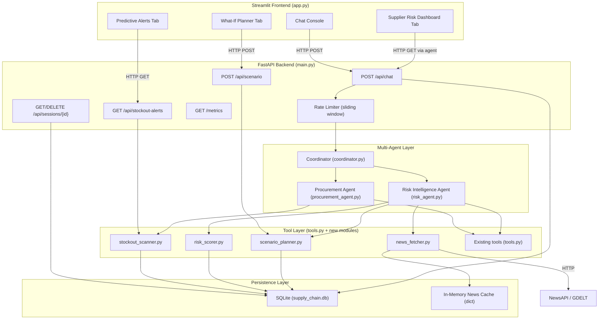

# Design Document: Aegis Enhanced Features

## Overview

This document describes the technical design for seven enhancement areas to the Aegis Autonomous Supply Chain Resilience Agent. The existing system is a FastAPI + Streamlit + LangChain ReAct loop backed by SQLite. The enhancements introduce multi-agent orchestration, predictive analytics, live news integration, scenario planning, session persistence, and production hardening — all while maintaining backward compatibility with the existing `/api/chat` endpoint.

The design philosophy is additive: new modules are introduced as separate files, existing files are extended minimally, and the database is migrated non-destructively.

---

## Architecture

### High-Level System Diagram



### Request Flow: Chat

```
Browser → Streamlit → POST /api/chat → RateLimiter → Coordinator
  → classify intent
  → if procurement: ProcurementAgent.run(query, history)
  → if risk/news:   RiskIntelligenceAgent.run(query, history)
  → if both:        run sequentially, merge responses
  → write user+assistant messages to ChatSessions
  → return ChatResponse
```

---

## Components and Interfaces

### New File Structure

```
aegis/
├── app.py                    # Extended: new tabs (Alerts, Risk, Scenario)
├── main.py                   # Extended: new endpoints, rate limiting, metrics
├── agent.py                  # Replaced by coordinator.py (kept for reference)
├── coordinator.py            # NEW: top-level orchestration agent
├── procurement_agent.py      # NEW: inventory/orders sub-agent
├── risk_agent.py             # NEW: risk/news/scenario sub-agent
├── stockout_scanner.py       # NEW: predictive stockout logic
├── risk_scorer.py            # NEW: supplier risk scoring logic
├── news_fetcher.py           # NEW: live news with cache + fallback
├── scenario_planner.py       # NEW: what-if scenario analysis
├── session_store.py          # NEW: ChatSessions persistence helpers
├── tools.py                  # Extended: scan_stockout_alerts, get_supplier_risk_scores, run_scenario
├── database.py               # Extended: new tables in init_db / migrate_db
├── guardrails.py             # Unchanged
├── export_utils.py           # Unchanged
└── tests/
    └── test_guardrails.py    # NEW: unit tests for guardrails
```

### coordinator.py

```python
class Coordinator:
    def classify_intent(self, query: str) -> list[str]:
        """
        Returns a list containing 'procurement', 'risk', or both.
        Uses keyword matching with LLM fallback.
        """

    def run(self, query: str, history: list[dict]) -> dict:
        """
        Routes query to sub-agents, merges responses.
        Returns {"response": str, "actions": list}.
        On sub-agent error, returns graceful error message.
        """
```

Intent classification uses a keyword set first (fast path), then falls back to a single LLM call if ambiguous:

- Procurement keywords: `inventory`, `stock`, `order`, `purchase`, `stockout`, `reorder`, `lead time`, `product`
- Risk keywords: `supplier`, `risk`, `news`, `disruption`, `event`, `scenario`, `reroute`, `score`

### procurement_agent.py

```python
class ProcurementAgent:
    tools: list  # [check_inventory, simulate_ripple_effect, create_purchase_order,
                 #  scan_stockout_alerts, query_database]

    def run(self, query: str, history: list[dict]) -> dict:
        """Executes ReAct loop with procurement tools. Returns response dict."""
```

### risk_agent.py

```python
class RiskIntelligenceAgent:
    tools: list  # [check_supplier_status, check_global_news, get_supplier_risk_scores,
                 #  query_database, run_scenario]

    def run(self, query: str, history: list[dict]) -> dict:
        """Executes ReAct loop with risk/news/scenario tools. Returns response dict."""
```

### stockout_scanner.py

```python
def scan_stockouts(horizon_days: int) -> list[dict]:
    """
    Queries Products JOIN Inventory.
    Filters: stock - (daily_rate * horizon_days) <= reorder_level
    daily_rate = reorder_level / lead_time_days (when no explicit rate)
    Returns list of StockoutAlert dicts, empty list if none found.
    Raises ValueError if horizon_days < 1 or > 365.
    """

def _compute_daily_rate(reorder_level: int, lead_time_days: int) -> float:
    """Returns reorder_level / lead_time_days, guarded against division by zero."""
```

### risk_scorer.py

```python
HIGH_RISK_COUNTRIES = {"North Korea", "Syria", "Iran", "Cuba", "Russia"}

def compute_risk_score(supplier_id: str) -> SupplierRiskScore:
    """
    Computes composite score = location_sub (40) + failure_sub (40) + disruption_sub (20).
    Persists result to SupplierRiskScores table.
    Returns SupplierRiskScore dataclass.
    """

def compute_all_risk_scores() -> list[SupplierRiskScore]:
    """Iterates all suppliers, calls compute_risk_score for each, returns list."""

def _location_sub_score(location: str, status: str) -> float:
    """Returns 40 if location in HIGH_RISK_COUNTRIES or status == 'Restricted', else proportional score."""

def _failure_sub_score(supplier_id: str) -> float:
    """
    Queries Orders for supplier. 
    failure_rate = failed_orders / total_orders.
    Returns min(failure_rate * 40, 40). Returns 0 if no orders.
    """

def _disruption_sub_score(location: str) -> float:
    """Returns 20 if any active Events row matches supplier location, else 0."""
```

### news_fetcher.py

```python
# Module-level cache: {keyword: {"data": [...], "fetched_at": datetime}}
_cache: dict = {}
CACHE_TTL_SECONDS = 900  # 15 minutes

def fetch_news(keyword: str) -> dict:
    """
    1. Check _cache for keyword; return cached if within TTL.
    2. If NEWS_API_KEY set: call NewsAPI /v2/everything with keyword.
    3. Parse up to 5 articles into NewsArticle dicts.
    4. On failure or missing key: return fallback mock + {"fallback": True}.
    5. Log warning to error.log if key missing.
    """

def _call_newsapi(keyword: str, api_key: str) -> list[dict]:
    """HTTP GET to newsapi.org/v2/everything. Returns parsed article list."""

def _call_gdelt(keyword: str) -> list[dict]:
    """HTTP GET to GDELT API as secondary fallback. Returns parsed article list."""

def _fallback_mock(keyword: str) -> dict:
    """Returns existing hardcoded mock data with fallback=True flag."""
```

NewsArticle structure:
```python
{
    "title": str,
    "source": str,
    "published_at": str,   # ISO 8601
    "url": str,
    "relevance_keyword": str,
    "fallback": bool        # only present when True
}
```

### scenario_planner.py

```python
def run_scenario(supplier_id: str, offline_days: int) -> dict:
    """
    1. Validate supplier exists; raise ValueError if not.
    2. Query Products sourced from supplier_id (via Orders or a SupplierProducts mapping).
    3. For each product: exposure = unit_cost * stock.
    4. Sum exposures for total_financial_exposure.
    5. Query up to 3 Active, non-restricted, non-disrupted alternative suppliers.
    6. Return ScenarioResult dict.
    Raises ValueError if offline_days < 1 or > 365.
    """

def _get_affected_products(supplier_id: str) -> list[dict]:
    """Returns products linked to supplier via Orders table."""

def _get_alternative_suppliers(exclude_id: str) -> list[dict]:
    """Returns up to 3 Active suppliers not in restricted locations."""
```

ScenarioResult structure:
```python
{
    "scenario_summary": str,
    "affected_products": [{"product_id", "name", "unit_cost", "stock", "exposure"}],
    "total_financial_exposure": float,
    "currency": "USD",
    "recommended_alternatives": [{"supplier_id", "name", "location"}]
}
```

### session_store.py

```python
def save_message(session_id: str, role: str, content: str) -> None:
    """Inserts a row into ChatSessions."""

def get_history(session_id: str) -> list[dict]:
    """Returns all messages for session ordered by timestamp ASC."""

def delete_session(session_id: str) -> None:
    """Deletes all ChatSessions rows for the given session_id."""
```

### main.py Extensions

New endpoints added to existing FastAPI app:

```python
# Stockout alerts
@app.get("/api/stockout-alerts")
def get_stockout_alerts(horizon_days: int = Query(default=30, ge=1, le=365)) -> StockoutAlertsResponse

# Scenario planner
@app.post("/api/scenario")
def run_scenario_endpoint(request: ScenarioRequest) -> ScenarioResponse
# ScenarioRequest: supplier_id: str, offline_days: int = Field(ge=1, le=365)

# Session history
@app.get("/api/sessions/{session_id}/history")
def get_session_history(session_id: str) -> list[ChatMessage]

@app.delete("/api/sessions/{session_id}")
def delete_session_endpoint(session_id: str) -> dict

# Metrics
@app.get("/metrics")
def get_metrics() -> MetricsResponse

# Chat endpoint extended with:
# - query: str = Field(min_length=1, max_length=2000)
# - rate limiting middleware
# - session persistence (write to ChatSessions before returning)
```

### Rate Limiter

Implemented as a FastAPI middleware using a sliding-window counter stored in a module-level `dict[str, deque]` keyed by client IP:

```python
class RateLimitMiddleware(BaseHTTPMiddleware):
    """
    Sliding window: tracks request timestamps per IP.
    Limit: 30 requests / 60 seconds on /api/chat.
    Returns 429 with Retry-After header on breach.
    """
    _windows: dict[str, deque] = {}
    LIMIT = 30
    WINDOW_SECONDS = 60
```

---

## Data Models

### New SQLite Tables

#### SupplierRiskScores

```sql
CREATE TABLE IF NOT EXISTS SupplierRiskScores (
    id              INTEGER PRIMARY KEY AUTOINCREMENT,
    supplier_id     TEXT NOT NULL,
    score           REAL NOT NULL,          -- 0–100 composite
    location_sub_score  REAL NOT NULL,      -- 0–40
    failure_sub_score   REAL NOT NULL,      -- 0–40
    disruption_sub_score REAL NOT NULL,     -- 0–20
    computed_at     TEXT NOT NULL,          -- ISO 8601 timestamp
    FOREIGN KEY(supplier_id) REFERENCES Suppliers(supplier_id)
);
CREATE INDEX IF NOT EXISTS idx_srs_supplier ON SupplierRiskScores(supplier_id);
```

#### ChatSessions

```sql
CREATE TABLE IF NOT EXISTS ChatSessions (
    id          INTEGER PRIMARY KEY AUTOINCREMENT,
    session_id  TEXT NOT NULL,
    role        TEXT NOT NULL CHECK(role IN ('user', 'assistant')),
    content     TEXT NOT NULL,
    timestamp   TEXT NOT NULL               -- ISO 8601 timestamp
);
CREATE INDEX IF NOT EXISTS idx_cs_session ON ChatSessions(session_id, timestamp);
```

### Migration Strategy

Both tables are added to `database.py`'s `init_db()` via `CREATE TABLE IF NOT EXISTS`. The existing `migrate_db()` function is extended to handle any column additions needed. No existing tables are modified destructively.

### Pydantic Models (main.py)

```python
class StockoutAlert(BaseModel):
    product_id: str
    product_name: str
    current_stock: int
    reorder_level: int
    lead_time_days: int
    estimated_days_until_stockout: float

class ScenarioRequest(BaseModel):
    supplier_id: str
    offline_days: int = Field(ge=1, le=365)

class ChatMessage(BaseModel):
    role: str
    content: str
    timestamp: str

class MetricsResponse(BaseModel):
    total_orders: int
    blocked_orders: int
    total_audit_logs: int
    active_suppliers: int
    uptime_seconds: float

class ChatRequest(BaseModel):
    query: str = Field(min_length=1, max_length=2000)
    history: list = []
    session_id: str | None = None
```

---


## Correctness Properties

*A property is a characteristic or behavior that should hold true across all valid executions of a system — essentially, a formal statement about what the system should do. Properties serve as the bridge between human-readable specifications and machine-verifiable correctness guarantees.*

### Property 1: Stockout filter correctness

*For any* set of inventory rows with known stock, reorder_level, and lead_time_days values, every product returned by `scan_stockouts(N)` must satisfy `stock - ((reorder_level / lead_time_days) * N) <= reorder_level`, and every product that satisfies this inequality must appear in the results. The `estimated_days_until_stockout` field for each result must equal `(stock - reorder_level) / daily_rate`.

**Validates: Requirements 1.1, 1.2, 1.3**

---

### Property 2: Risk score composite invariant

*For any* supplier, the composite score returned by `compute_risk_score` must equal `location_sub_score + failure_sub_score + disruption_sub_score` and must be in the range [0, 100].

**Validates: Requirements 2.1**

---

### Property 3: Restricted location yields maximum location sub-score

*For any* supplier whose `location` is in the high-risk country set or whose `status` is `Restricted`, `_location_sub_score` must return exactly 40.

**Validates: Requirements 2.2**

---

### Property 4: Active disruption yields maximum disruption sub-score

*For any* supplier whose location matches at least one active Events row, `_disruption_sub_score` must return exactly 20.

**Validates: Requirements 2.4**

---

### Property 5: Risk score persistence round-trip

*For any* supplier, after calling `compute_risk_score(supplier_id)`, querying the `SupplierRiskScores` table for that supplier must return a row whose `score`, `location_sub_score`, `failure_sub_score`, and `disruption_sub_score` match the returned dataclass values.

**Validates: Requirements 2.5**

---

### Property 6: Coordinator routing correctness

*For any* query string, `Coordinator.classify_intent` must return `['procurement']` when the query contains only procurement keywords, `['risk']` when it contains only risk keywords, and both when it contains keywords from both domains. The sub-agents invoked by `Coordinator.run` must match the classified intents.

**Validates: Requirements 3.1, 3.2, 3.3**

---

### Property 7: Coordinator history propagation

*For any* conversation history list passed to `Coordinator.run`, every sub-agent invoked by the coordinator must receive that same history list as its `history` argument.

**Validates: Requirements 3.7**

---

### Property 8: News article output structure

*For any* successful response from the news fetcher (live or cached), the returned list must contain at most 5 items, and each item must contain the keys `title`, `source`, `published_at`, `url`, and `relevance_keyword`.

**Validates: Requirements 4.3**

---

### Property 9: News cache idempotence within TTL

*For any* keyword, calling `fetch_news(keyword)` twice within 15 minutes must return identical data on the second call without making a new HTTP request to the external API (verified by asserting the HTTP mock is called exactly once).

**Validates: Requirements 4.6**

---

### Property 10: Scenario financial exposure calculation

*For any* valid `supplier_id` and `offline_days`, the `total_financial_exposure` in the result must equal the sum of `unit_cost * stock` for every product in `affected_products`, and the result must contain all required fields: `scenario_summary`, `affected_products`, `total_financial_exposure`, `currency`, and `recommended_alternatives`.

**Validates: Requirements 5.1, 5.2, 5.4**

---

### Property 11: Scenario alternatives validity

*For any* scenario result, every entry in `recommended_alternatives` must have `status == 'Active'`, must not be in the restricted country list, must not equal the disrupted `supplier_id`, and the list must contain at most 3 entries.

**Validates: Requirements 5.3**

---

### Property 12: Session persistence round-trip

*For any* `session_id`, `role`, and `content`, after calling `save_message(session_id, role, content)`, calling `get_history(session_id)` must return a list containing a message with matching `role` and `content`.

**Validates: Requirements 6.1, 6.3**

---

### Property 13: Session history ordering

*For any* session with multiple messages inserted at different timestamps, `get_history(session_id)` must return them in ascending timestamp order.

**Validates: Requirements 6.5**

---

### Property 14: Session delete clears all messages

*For any* session with one or more messages, after calling `delete_session(session_id)`, calling `get_history(session_id)` must return an empty list.

**Validates: Requirements 6.6**

---

### Property 15: Chat input validation rejects invalid lengths

*For any* query string of length 0 (empty) or length greater than 2000 characters, `POST /api/chat` must return HTTP 422.

**Validates: Requirements 7.2**

---

### Property 16: Rate limiting enforcement with Retry-After

*For any* sequence of 31 or more requests to `POST /api/chat` from the same IP address within a 60-second window, the 31st request must receive HTTP 429 with a `Retry-After` header present in the response.

**Validates: Requirements 7.3, 7.4**

---

### Property 17: Guardrail cost threshold

*For any* cost value strictly greater than 10000, `validate_order_cost` must return a dict with `status == 'BLOCKED'`. *For any* cost value of exactly 10000 or less, `validate_order_cost` must return `None`.

**Validates: Requirements 7.5, 7.6**

---

### Property 18: Guardrail location blocking

*For any* supplier whose location is in the restricted country list or whose status is `Restricted`, `validate_supplier_location` must return a dict with `status == 'BLOCKED'`. *For any* supplier in a non-restricted location with `Active` status, `validate_supplier_location` must return `None`.

**Validates: Requirements 7.7, 7.9**

---

### Property 19: Reroute always blocked

*For any* `supplier_id` value, `check_guardrails_for_reroute` must return a non-None JSON string with `status == 'BLOCKED'`.

**Validates: Requirements 7.8**

---

## Error Handling

### Validation Errors (HTTP 422)
FastAPI's Pydantic validation handles `horizon_days` and `offline_days` range checks (`ge=1, le=365`) and `query` length checks (`min_length=1, max_length=2000`) automatically. Custom error messages are provided via `Field(description=...)`.

### Rate Limit Errors (HTTP 429)
`RateLimitMiddleware` intercepts requests before they reach route handlers. The `Retry-After` header value is computed as `WINDOW_SECONDS - (now - oldest_request_in_window)`.

### News Fetcher Failures
Any `requests.RequestException` or non-200 HTTP status from the external news API triggers the fallback path. The fallback response includes `"fallback": true`. Missing `NEWS_API_KEY` logs a `WARNING` to `error.log` via Python's `logging` module.

### Sub-Agent Failures
The `Coordinator.run` method wraps each sub-agent call in a `try/except`. On exception, it logs to `AuditLogs` and returns a user-facing message like `"One or more analysis components encountered an error. Partial results may be available."` rather than propagating the exception.

### Scenario Planner — Unknown Supplier
`run_scenario` raises `ValueError("Supplier {supplier_id} not found")` which the FastAPI endpoint catches and converts to HTTP 404 with a descriptive JSON body.

### Database Initialization
`ChatSessions` and `SupplierRiskScores` tables are created with `CREATE TABLE IF NOT EXISTS` inside `init_db()`, so they are always present before any endpoint is called. `migrate_db()` is called at startup to handle existing databases.

---

## Testing Strategy

### Dual Testing Approach

Both unit tests and property-based tests are required. Unit tests cover specific examples, integration points, and error conditions. Property-based tests verify universal correctness across randomized inputs.

### Property-Based Testing Library

**pytest-hypothesis** (Python) is the chosen library. It integrates natively with pytest, provides rich strategy combinators, and supports database-backed tests via fixtures.

Each property test must run a minimum of **100 examples** (configured via `@settings(max_examples=100)`).

Each test must be tagged with a comment in the format:
```
# Feature: aegis-enhanced-features, Property N: <property_text>
```

### Property Test Mapping

| Property | Test Location | Hypothesis Strategy |
|---|---|---|
| P1: Stockout filter | `tests/test_stockout_scanner.py` | `st.integers`, `st.floats` for inventory rows |
| P2: Risk score composite | `tests/test_risk_scorer.py` | `st.text`, `st.floats` for supplier data |
| P3: Restricted location score | `tests/test_risk_scorer.py` | `st.sampled_from(HIGH_RISK_COUNTRIES)` |
| P4: Disruption score | `tests/test_risk_scorer.py` | `st.text` for location with matching event |
| P5: Risk score persistence | `tests/test_risk_scorer.py` | `st.text` for supplier_id with DB fixture |
| P6: Coordinator routing | `tests/test_coordinator.py` | `st.sampled_from(keyword_lists)` |
| P7: History propagation | `tests/test_coordinator.py` | `st.lists(st.fixed_dictionaries(...))` |
| P8: News article structure | `tests/test_news_fetcher.py` | `st.text` for keyword, mocked HTTP |
| P9: News cache idempotence | `tests/test_news_fetcher.py` | `st.text` for keyword, mocked HTTP |
| P10: Scenario exposure | `tests/test_scenario_planner.py` | `st.text`, `st.integers` with DB fixture |
| P11: Alternatives validity | `tests/test_scenario_planner.py` | `st.text` for supplier_id with DB fixture |
| P12: Session round-trip | `tests/test_session_store.py` | `st.text` for session_id, role, content |
| P13: History ordering | `tests/test_session_store.py` | `st.lists` of messages with timestamps |
| P14: Session delete | `tests/test_session_store.py` | `st.text` for session_id |
| P15: Input validation | `tests/test_main.py` | `st.integers(max_value=0)`, `st.text(min_size=2001)` |
| P16: Rate limiting | `tests/test_main.py` | Fixed sequence of 31 requests |
| P17: Guardrail cost | `tests/test_guardrails.py` | `st.floats(min_value=10000.01)`, `st.floats(max_value=10000)` |
| P18: Guardrail location | `tests/test_guardrails.py` | `st.sampled_from(restricted)`, `st.text` for non-restricted |
| P19: Reroute blocked | `tests/test_guardrails.py` | `st.text` for supplier_id |

### Unit Test Coverage

Unit tests (in `tests/test_guardrails.py` and others) cover:
- Specific boundary values (cost == 10000, cost == 10001)
- Integration between `Coordinator` and sub-agents using mocked sub-agents
- API endpoint responses with `TestClient` from FastAPI
- Database initialization and migration idempotency
- News fetcher fallback with mocked `requests.get`

### Test Configuration

```python
# conftest.py
@pytest.fixture
def test_db(tmp_path):
    """Provides an isolated SQLite DB for each test."""
    db_path = tmp_path / "test.db"
    # patch DB_NAME and init
    ...

# Example property test structure
from hypothesis import given, settings
from hypothesis import strategies as st

@given(cost=st.floats(min_value=10000.01, max_value=1e9, allow_nan=False))
@settings(max_examples=100)
def test_guardrail_blocks_high_cost(cost):
    # Feature: aegis-enhanced-features, Property 17: Guardrail cost threshold
    result = validate_order_cost(cost)
    assert result is not None
    assert result["status"] == "BLOCKED"
```

### New Dependencies

Add to `requirements.txt`:
```
pytest
hypothesis
pytest-asyncio
httpx              # for FastAPI TestClient async support
newsapi-python     # optional: official NewsAPI client
slowapi            # alternative: for rate limiting (or custom middleware)
```
